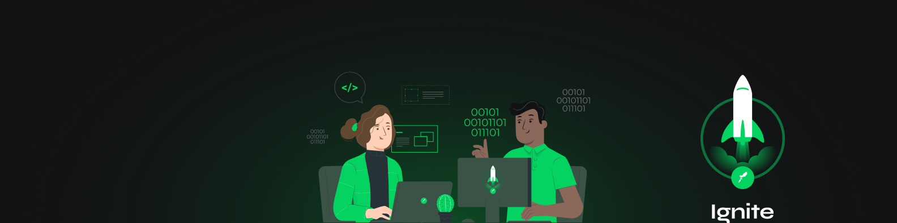

    

Project build as the third module of <strong>Ignite, an educational program by <a href="rocketseat.com.br/" target="_blank">Rocketseat</strong></a>

  

<small style="font-family:monospace;">
The Ignite's ReactJS || Next.js Leaning Pathway is taught by <a href="https://www.linkedin.com/in/diego-schell-fernandes" target="_blank">Diego Fernandes</a>
</small>

## Chapter III - Next.js Fundamentals

     

        <strong>Scaffolding the App</strong>
     

    <ol style="list-style:none">
        <li>☑️Introduction to module</li>
        <li>☑️Application flow in React && Next.js</li>
        <li>☑️Next.js basics</li>
        <li>☑️Adding TypeScript</li>
        <li>☑️Styling with SaSS</li>
        <li>☑️The `_document` page: configuring an external font-family</li>
        <li>☑️Setting dynamic page titles</li>
    </ol>

     

        <strong>Components && Pages</strong>
     

    <ol style="list-style:none">
        <li>☑️Component: Header</li>
        <li>☑️Component: Sign in Button</li>
        <li>☑️Structured and styled the homepage</li>
        <li>☑️Component: SubscribeButton</li>
    </ol>

     

        <strong>Integration with API</strong>
     

    <ol style="list-style:none">
        <li>☑️Configuring Stripe</li>
        <li>☑️Consuming Stripe's API (SSR)</li>
        <li>☑️Static Site Generation (SSG)</li>
    </ol>

## Chapter IV - Server-side Next.js

     

        <strong>API Routes in Next.js</strong>
     

    <ol style="list-style:none">
        <li>☑️ Implementing API Routes</li>
        <li>☑️ Approaches in Authentication using Next.js</li>
        <li>☑️ Parametrization in Routes</li>
    </ol>
</details
